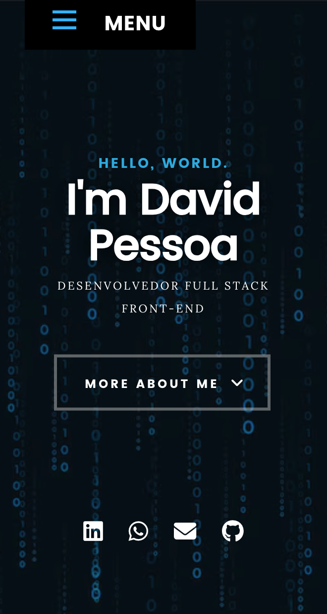
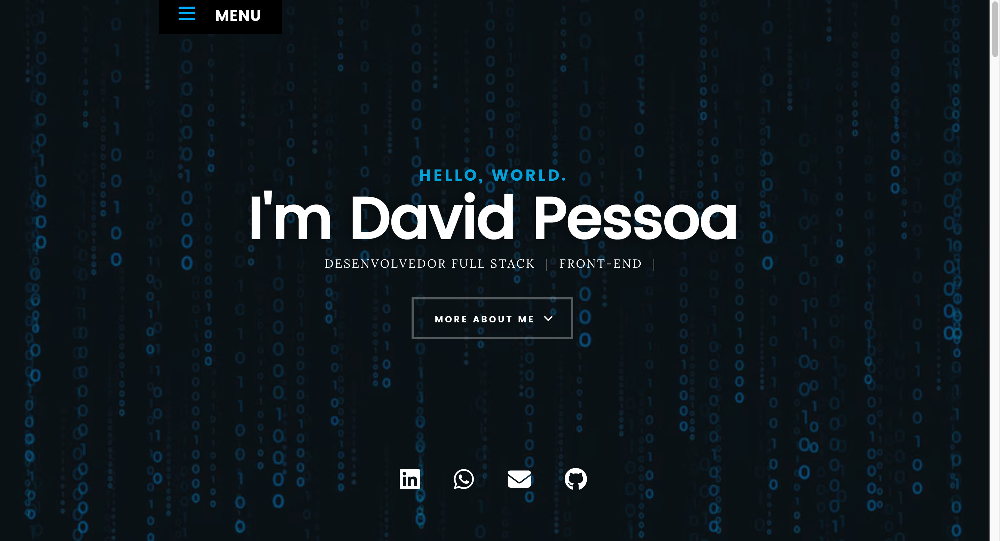

# Portfólio - David Pessoa
Portfólio pessoal com apresentação profissional, projetos, certificados, habilidades e contato.
O site é estático, responsivo e organizado para exibir conteúdos em português e inglês.

## Problema
Facilitar a apresentação da minha trajetória, experiências e projetos em um único lugar, com navegação simples, conteúdo atualizado e acesso rápido para recrutadores, parceiros e visitantes.

## Solução
Foi construído um portfólio web leve e sem build, com página inicial em formato one page, seção dedicada a projetos e conteúdo carregado dinamicamente a partir de arquivos JSON. O site também suporta troca de idioma e componentes reutilizáveis.

## Funcionalidades
- Apresentação pessoal com links para LinkedIn, WhatsApp, e-mail e GitHub.
- Seções de resumo profissional, habilidades, projetos, certificados e contato.
- Página individual para cada projeto com descrição detalhada e mídias associadas.
- Suporte a português e inglês via `i18next`.
- Carregamento dinâmico de listas de projetos, certificados e skills a partir de `dados.json`.
- Layout responsivo com carrossel de certificados e navegação por seções.

## Tecnologias
- HTML5
- CSS3
- JavaScript
- jQuery
- i18next
- Swiper
- Masonry
- imagesLoaded
- Font Awesome
- JSON como fonte de dados
- Hospedagem estática via GitHub Pages / domínio próprio

## Arquitetura
O fluxo principal funciona assim:

`dados.json` e `locales/*/translation.json` -> `js/loadLists.js` e `js/i18n.js` -> renderização dos blocos no `index.html` e na página `projetos/index.html`.

Em alto nível, a home monta os conteúdos dinâmicos de habilidades, projetos e certificados, enquanto a página de detalhes usa o `id` da URL para buscar o projeto correto em `dados.json` e exibir título, descrição, skills e mídia.

## Como rodar
O projeto não depende de instalação de pacotes. Para rodar localmente, use um servidor estático:

```bash
python3 -m http.server 8000
```

Depois acesse:

```text
http://localhost:8000
```

Se preferir, também é possível usar qualquer servidor estático equivalente.

## Prints
### Mobile


### Desktop


## Decisões técnicas
- O projeto foi mantido como site estático para facilitar deploy e manutenção.
- O conteúdo foi separado em `dados.json` para reduzir dependência de HTML repetido e simplificar atualizações.
- A internacionalização foi centralizada em arquivos de tradução para manter os textos organizados por idioma.
- Bibliotecas legadas do template original, como `jQuery` e plugins associados, foram mantidas por compatibilidade e para evitar uma refatoração maior.
- A página de detalhes de projeto usa parâmetro de URL em vez de rotas complexas, o que simplifica a navegação em hospedagem estática.

## Melhorias futuras
- Adicionar prints reais de desktop e mobile na seção de mídia.
- Atualizar a base do front-end para reduzir dependências antigas do template.
- Melhorar a acessibilidade com revisão de contraste, foco e navegação por teclado.
- Automatizar a geração de uma versão em inglês do README.
- Evoluir a arquitetura para componentes mais modulares, caso o site cresça.
